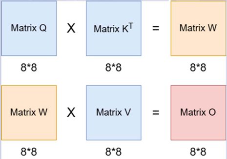

# Transformer Attention Mechanism

## Table of Contents
- [Overview](#overview)
- [Implementation Status](#implementation-status)
- [File Description](#file-description)
- [Specification](#specification)
- [Method](#method)

&nbsp;

## Overview

This project designs a simplified version of the transformer attention mechanism in Verilog. All multiplication operations utilize the Chipware component CW_mult.

### Brief introduction of attention mechanism

The **attention mechanism** is the core of Transformer architectures, enabling models to dynamically focus on relevant parts of the input. It computes weighted outputs based on the relationships between Query (Q), Key (K), and Value (V) matrices:

- **Query (Q)**: Represents "what we are looking for" - the current element seeking information
- **Key (K)**: Represents "what information is available" - used to match with queries
- **Value (V)**: Represents "the actual information to retrieve" - the content to be weighted and aggregated

The mechanism works like a database lookup: Q searches through K to find relevant matches, then retrieves the corresponding V values weighted by their relevance.

**Basic Formula**: `Attention(Q, K, V) = (Q × Kᵀ) × V`

### Architecture

The system receives three 8×8 matrices representing Q, K, and V. First, K is transposed to obtain Kᵀ. Then, Q is multiplied by Kᵀ to produce the W matrix. Next, W is multiplied by V to generate the final output matrix O. Finally, the information of the O matrix is output when the done signal is asserted high.

&nbsp;

## Implementation Status

Gate-level simulation completed.

&nbsp;

## File Description

- **TRANSFORMER_ATTENTION.v**: Main module of this project
- **TEST.v**: Testbench of the project

&nbsp;

## Specification

### Input Ports
- `clk`: Clock signal
- `reset`: Reset signal
- `en`: Enable signal
- `MATRIX_Q[3:0]`: Query matrix data
- `MATRIX_K[3:0]`: Key matrix data
- `MATRIX_V[3:0]`: Value matrix data

### Output Ports
- `done`: Done signal
- `answer[17:0]`: Calculation result

**Note:** 
- All input signals are synchronized at the clock rising edge.
- The reset scheme is an active-high asynchronous reset.
- In logic synthesis, the timing constraint for the clock period is set to 0.55ns.

&nbsp;

## Method

- The Verilog module needs to load three 8×8 matrices into memory: Q (query), K (key), V (value).

- First step is to transpose the K matrix to form KT, then compute W = Q × KT, and finally compute the final output matrix O = W × V.
